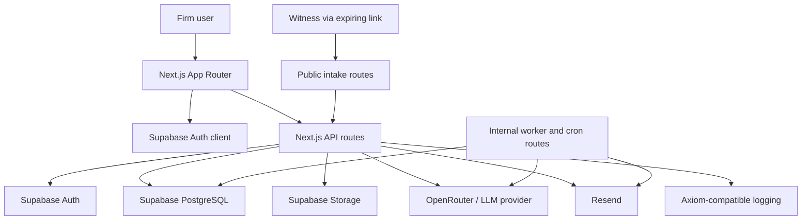

# Casey

Casey is a multi-tenant workspace for legal practices to collect, structure, review, and manage witness statements. It combines a firm-facing case workspace with a secure, token-based witness intake flow and AI-assisted drafting and analysis.

## Product Overview

A typical workflow is:

1. A legal team creates or selects a case and statement template.
2. The team invites a witness using a time-limited intake link.
3. The witness acknowledges the privacy notice, completes a guided interview, and uploads supporting evidence.
4. Casey formalizes the interview into a structured witness statement and makes the document available for review.
5. The legal team reviews the statement, requests follow-up information, collaborates with internal notes and mentions, and sends a final review link.
6. The witness reviews and signs the completed statement.
7. The team can generate case analysis, export documents, and retain an auditable record of the workflow.

Casey is implemented as a Next.js application with Supabase providing authentication, PostgreSQL data storage, row-level security, and storage policies.

## Architecture and System Design

### Runtime architecture



### Request and data flow

- Browser pages and client components use the Supabase client for the signed-in session and tenant-scoped reads.
- Protected API routes validate bearer tokens, resolve the user profile and role, validate request bodies with Zod, and perform privileged server-side operations through the server-only Supabase client.
- Witness routes resolve an expiring magic-link token before loading statement data. Intake state, conversation messages, consent, uploads, review actions, and signatures are persisted against the statement.
- AI requests are mediated by server routes. Streaming responses are returned to the browser while conversation messages, progress metadata, configuration patches, and generated snapshots are persisted as appropriate.
- Long-running case analysis and formalization work is represented by database-backed jobs or snapshots and can be dispatched through internal worker routes. Scheduled routes handle reminders and tenant cleanup.
- Documents follow separate paths for witness-uploaded evidence, statement supporting documents, internal case/statement documents, generated DOCX output, and final-review files.

### Data model boundaries

The primary ownership hierarchy is:

```text
Tenant
	|- Profiles and roles
	|- Cases
	|    |- Case notes, documents, analysis snapshots, and generation jobs
	|    `- Statements
	|         |- Conversation messages and intake state
	|         |- Supporting documents and evidence metadata
	|         |- Internal notes and reminders
	|         `- Formalization, review, and signing snapshots
	`- Templates, invitations, notifications, audit logs, and retention settings
```

Template configuration is versioned through snapshots. Cases also capture configuration snapshots so later template changes do not silently alter an active matter. JSONB fields are used for flexible case metadata, witness metadata, statement sections, conversation metadata, and generation payloads.

### Authorization and isolation

- Supabase RLS is the database-level isolation boundary for tenant-owned data.
- Roles are `app_admin`, `tenant_admin`, `solicitor`, and `paralegal`; write permissions vary by resource and role.
- Server-only service-client access is guarded by explicit server-only assertions and route-level authentication checks.
- Public witness access is limited to valid, unexpired tokens and the statement associated with each token.
- Audit triggers and application audit events record sensitive lifecycle and administrative actions.
- Rate limits, security headers, CSP reporting, storage policies, retention rules, and cleanup jobs provide additional operational safeguards.

## Implemented Features

### Firm workspace

- Role-based dashboards for app admins, tenant admins, solicitors, and paralegals.
- Multi-tenant organisations with tenant-scoped cases, statements, users, templates, documents, and notifications.
- Case creation, assignment, status tracking, metadata, and case detail views.
- Witness statement tracking through draft, in-progress, submitted, and locked states.
- Team member listing, invitations, role management, and tenant lifecycle controls.
- Case and statement template management with reusable statement configuration.
- Published template configuration snapshots for consistent statement generation.

### Witness intake

- Public witness access through expiring magic-link tokens.
- Privacy notice acknowledgement with request metadata.
- Guided conversational interview with persisted conversation history.
- Follow-up questions and follow-up response handling.
- Read-only witness details once a statement reaches final review.
- Supporting document uploads during intake and final review.
- Evidence descriptors and programmatic evidence/exhibit sections.
- Final witness review and signing flow.
- Email notifications for intake links, follow-up requests, and final review.

### AI-assisted workflows

- AI-guided witness interviewing through OpenRouter-compatible models.
- Streaming interview responses and progress metadata.
- Response formalization into structured statement sections.
- AI-generated statement configuration and template updates from natural-language requests.
- Restore points and incremental configuration patches in the template generator.
- AI-assisted DOCX review and edited document summaries.
- Case analysis with normalized facts, chronology, evidence context, and source references.
- Tracked case-analysis generation jobs with queued, running, succeeded, and failed states.
- Configurable limits for formalization turns, input size, timeout, and retry attempts.

### Collaboration and operations

- Internal case and statement notes.
- User mentions, in-app notifications, and optional mention email notifications.
- Statement reminder rules and scheduled reminder dispatch.
- Case and statement internal documents.
- Demo Studio for app admins to bootstrap and inspect demo statements and intake links.
- Waitlist signup handling.
- Account deletion requests, self-deletion safeguards, and tenant soft-delete/restore lifecycle.
- User and tenant data exports for data-subject access requests.

### Security and compliance controls

- Supabase Row Level Security policies for tenant and role isolation.
- Server-side authorization for protected API routes and service-client access.
- Persistent API rate limiting for sensitive endpoints.
- Expiring, tenant-scoped witness magic links.
- Audit logging for administrative, lifecycle, collaboration, and data-access actions.
- Storage policies and cleanup helpers for tenant-owned files.
- Content Security Policy reporting/enforcement support and security response headers.
- GDPR, privacy, security, and terms pages included in the application.
- Retention periods, soft deletion, and scheduled tenant cleanup support.

## Technology

- Next.js 16 with the App Router
- React 19 and TypeScript
- Supabase Auth, PostgreSQL, Row Level Security, Storage, and scheduled jobs
- OpenRouter through the OpenAI SDK for AI model access
- Resend for transactional email
- DOCX generation and editing with `docx`, Docxtemplater, and the DOCX editor packages
- Zod for input and environment validation
- Vitest for integration tests
- Axiom-compatible structured server logging

## Getting Started

### Prerequisites

- Node.js compatible with the versions used by the project toolchain
- npm
- A Supabase project for development or the Supabase CLI and Docker for local development
- Credentials for OpenRouter and Resend when using AI and email features

### Installation

```bash
npm install
cp .env.example .env.local
```

Fill in the values in `.env.local`. The application validates build-time configuration in `src/lib/env.ts`.

At minimum, configure:

- `NEXT_PUBLIC_APP_NAME`
- `NEXT_PUBLIC_BASE_URL`
- `NEXT_PUBLIC_SUPABASE_URL`
- `NEXT_PUBLIC_SUPABASE_PUBLISHABLE_KEY`
- `SUPABASE_SECRET_KEY`
- `RESEND_API_KEY`
- `RESEND_FROM`
- `OPENROUTER_API_KEY`

Optional configuration includes support and scheduling links, `CRON_SECRET`, formalization limits, and Axiom logging variables. See `.env.example` for the complete list.

### Database

Apply the migrations in `supabase/migrations` to the target Supabase project. For a linked remote project:

```bash
npx supabase db push
```

The project can generate typed Supabase definitions with:

```bash
npm run supabase:types
```

For local Supabase development, start the stack and reset the database from the repository migrations:

```bash
npx supabase start
npx supabase db reset --local --yes --no-seed
```

### Run the application

```bash
npm run dev
```

The development server runs at [http://localhost:3000](http://localhost:3000) by default.

For a production-style run:

```bash
npm run build
npm run start
```

## Testing and Quality Checks

Run the linter:

```bash
npm run lint
```

Run the integration tests against configured services:

```bash
npm run test:integration
```

Run the integration tests with coverage:

```bash
npm run test:integration:coverage
```

The local test command starts Supabase, resets it from the repository migrations, loads the local connection values, runs the integration suite, and stops Supabase afterward:

```bash
npm run test:local
```

The integration suite covers authentication and tenant flows, RLS isolation, witness intake, follow-up and final review, evidence uploads, statement operations, AI-assisted routes, notifications, reminders, compliance exports, and storage cleanup.

## Application Areas

- `/` - product entry page
- `/auth` - magic-link authentication
- `/dashboard` - role-aware firm dashboard
- `/cases/[id]` - case workspace
- `/intake/[token]` - witness intake router
- `/intake/[token]/interview` - guided interview
- `/intake/[token]/follow-up` - follow-up response flow
- `/intake/[token]/final-review` - witness final review and signing
- `/settings` - tenant and profile settings
- `/settings/cases` - case template settings
- `/settings/statements` - statement template settings
- `/notifications` - user notifications
- `/dashboard/app-admin/demo-studio` - administrator demo tooling
- `/legal/gdpr`, `/legal/privacy`, `/legal/security`, `/legal/terms` - legal and security information

API routes are under `src/app/api`, including intake, authentication, invitations, tenant administration, document generation, AI generation, notifications, reminders, workers, and data exports.

## Repository Structure

```text
src/app/                 Next.js pages, layouts, and API routes
src/components/          Reusable UI and workflow components
src/contexts/             Tenant and user context providers
src/hooks/                Shared React hooks
src/lib/                  AI, documents, evidence, email, security, and Supabase logic
src/types/                Shared TypeScript and generated Supabase types
supabase/migrations/     PostgreSQL schema, RLS policies, indexes, and lifecycle jobs
tests/integration/       Vitest integration and security-flow tests
scripts/                 Local test orchestration
```

## Deployment Notes

The Next.js build requires the variables defined by `BuildEnvSchema` in `src/lib/env.ts`. Configure Supabase, Resend, OpenRouter, and the application base URL in the deployment environment before running the build.

Scheduled endpoints are included for reminder dispatch, statement formalization, case analysis, and tenant cleanup. Protect internal scheduled requests with `CRON_SECRET` and configure the corresponding scheduler or cron provider in the deployment environment.

Do not expose `SUPABASE_SECRET_KEY`, `RESEND_API_KEY`, `OPENROUTER_API_KEY`, `AXIOM_TOKEN`, or `SUPABASE_DB_PASSWORD` to client-side code.
